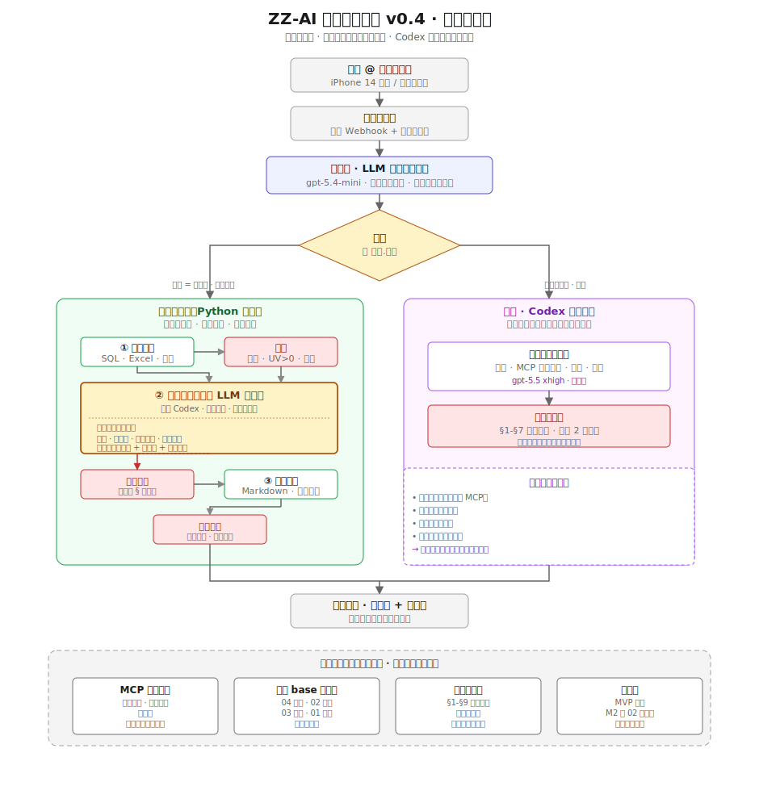

# ZZ-AI-Business-Analysis · 架构文档

> **v0.4 — workflow-first + agent-on-judgment**
>
> 版本：v0.4 (设计定稿，实施中)
> 上一版：v0.3.0 (all-agent 架构)
> 最后更新：2026-07-01

## 一、总览



> 可编辑源文件：[`v04-workflow-first.drawio`](./v04-workflow-first.drawio)（用 drawio.com 或 VSCode Draw.io Integration 插件打开）

**核心主张**：workflow 打底承载 80% 场景，agent 只在需要判断的节点（`spawn_agent`）介入；codex exec 完整循环仅作为兜底。

## 二、v0.3.0 vs v0.4 对比

| 维度 | v0.3.0（all-agent） | v0.4（workflow-first） |
|---|---|---|
| 主执行路径 | 全走 codex exec | Python workflow + spawn_agent |
| 每请求延迟 | 3-9 分钟 | 10-30 秒（workflow 主路径） |
| 确定性 | 低（agent 自由 tool loop） | 高（workflow 逻辑写死） |
| 判断力 | 有（但用错场景） | 有（只在 spawn_agent 节点） |
| Skill 形态 | markdown prompt | Python 模块 + skill.md 元数据 |
| 覆盖场景 | 全部（不管是不是该 agent） | 80% workflow · 20% fallback agent |

## 三、Router 层 — 智能分流

**位置**：`router/src/router/planner.py`（v0.3.0 已实现，v0.4 复用）

Router 是唯一的 LLM 路由决策点。收到用户问题后：

1. 扫描 `skills/` 目录下所有 skill 的 frontmatter
2. 调 gpt-5.4-mini 生成 `call_plan`（JSON）：`{skills: [{name, order, rationale}], fallback}`
3. 输出交给 dispatch 层

Router 只负责**选哪个 skill**，不负责决定 skill 内部是 workflow 还是 agent。

## 四、Skill Dispatch — type 决定路径

**每个 skill 声明 `type`**：

```yaml
---
name: category_weekly_report
type: workflow             # workflow | agent
description: 品类周报 workflow
inputs: { week: str, categories: list[str] }
outputs: { sheets_url: str }
---
```

Dispatch 层的行为：

```python
if not call_plan.skills:       # 没找到任何 skill
    → fallback 路径 (codex exec)
elif skill.type == "workflow":
    → workflow 引擎（主路径）
elif skill.type == "agent":
    → fallback 路径 (codex exec)  # 声明 agent 型 = 显式要 agent
```

**hybrid 概念不在 dispatch 层**——hybrid 是"workflow 模块内部选一步 spawn_agent"，dispatch 只认 workflow 和 agent 两类。

## 五、Workflow 路径（主，80% 场景）

Workflow 引擎加载 `skills/workflows/<name>/run.py`，执行 `run(params: Params) -> Result`。

`run()` 函数是**普通 Python 代码**，没有 DAG 定义。以品类周报为例：

```python
def run(params: Params) -> Result:
    # 步骤 1：确定 —— SQL 取数（秒级）
    df = fetch_data(params.week, params.categories)
    assert_result_shape(df)  # assertion 守门

    # 步骤 2：确定 —— 查历史案例（MCP 工具）
    cases = knowledge_base.query_metric("GMV")

    # 步骤 3：判断 —— AI 归因（spawn_agent）
    if has_anomaly(df):
        cause = spawn_agent(AgentStepInput(
            task="按 §4 异动四问归因",
            context={"drops": df.to_dict(), "cases": cases},
            principles_scope=["§1", "§4", "§5"],
            output_schema=AttributionReport,
        ))
        assert cause.confidence != "low", "低置信度需人工介入"

    # 步骤 4：确定 —— 拼装模板
    report = render_template(df, cause)

    # 步骤 5：最终 assertion
    assert_business_rules(report)

    # 步骤 6：写飞书
    return deliver_to_feishu(report)
```

**关键**：workflow 步骤之间的过渡由 assertion 守门；异常抛出直接失败，不静默降级。

## 六、`spawn_agent` — 受控 LLM call（关键设计）

**不是 codex exec**，是**单次受控 LLM 调用**。

### 契约

```python
class AgentStepInput(BaseModel):
    task: str                              # "按 §4 四问归因这批异动"
    context: dict                          # workflow 已算好的数据（序列化）
    principles_scope: list[str]            # 用哪几条 §（如 ["§1","§4","§5"]）
    output_schema: type[BaseModel]         # 强制的输出结构
    model: str = "gpt-5.5"
    max_tokens: int = 2000
    timeout_sec: int = 60

class AgentStepOutput(BaseModel):
    result: BaseModel                      # 符合 input.output_schema
    reasoning: str                          # 简短理由
    confidence: Literal["high","medium","low"]
    tokens_used: int
```

### 关键约束

| 约束 | 为什么 |
|---|---|
| **只单次调用**（不 loop） | workflow 秒级承诺 |
| **无 tool 权** | tool use 全在 workflow 主干（避免 agent 到处乱查扩展调用面） |
| **强制 Pydantic 输出** | workflow 后续步骤能直接消费 |
| **temperature=0** | 相同输入相同输出 |
| **HTTP 直调中转站** | 避 OpenAI SDK 的 stainless 头兼容问题（v0.3.0 已验证） |

### 实现路径

复用 `review_gate/critic.py` 已经用过的 `requests` 直调模式，新建 `ai_judge/` 包（v0.4 待实施）。

## 七、三层守门

红色框全是"守门"环节：

| 位置 | 守门方式 | 谁做 |
|---|---|---|
| workflow 步骤间 | 数据级 assertion（分区、UV>0、schema） | Python 代码 |
| spawn_agent 之后 | `review_agent_step`（scope 内的几条 § 自检） | 独立轻量 LLM 调用 |
| workflow 最终 | 业务规则 assertion（消息长度、动作数量、必填字段） | Python 代码 |

**关键差异**：workflow 路径**不跑完整 `review_gate` §1-§7**。原则约束已经分散嵌进各 spawn_agent 的 `principles_scope`，最终 assertion 只查业务规则。

## 八、Fallback 路径（codex exec）

**只在下列条件触发**：

- Router 输出 `skills=[]`（没匹配到任何 skill）
- 或 workflow 内 spawn_agent 全部返回 `confidence="low"` → workflow 声明失败 → 升级到 fallback

Fallback 走的路径是**完整的 v0.3.0 代码**（不改）：

1. `codex exec` 完整 agent 循环（plan · MCP tool call · reasoning · loop）
2. 完整 `review_gate` §1-§7 对抗审查
3. FAIL 则带 issues 重试 2 次

**特征**（跟 workflow 路径互补）：

- ✅ 有工具权（可以自由调 MCP）
- ✅ 无 Pydantic 输出契约（agent 自由发挥）
- ✅ 慢但兼容开放式问题（"帮我看看这数据有啥问题"）
- ❌ 延迟分钟级

**长期目标**：把 fallback 命中场景抽成 workflow skill，让 fallback 触发率→0。

## 九、支撑层

|模块 | source of truth | 谁用 |
|---|---|---|
| **MCP 原子工具**（data_tools / lark_tools / knowledge_base） | 服务器代码 | workflow 主干（读邮件 / 写飞书 / 查基础设施） |
| **飞书 base 知识库**（4 张表） | 飞书（业务团队维护） | workflow 主干 · knowledge_base MCP 代理 |
| **`principles/core.md`**（§1-§9 业务原则） | git 仓库 | workflow 按 `principles_scope` 切片喂 `spawn_agent` |
| **assertion 库** | MVP 手写 / M2 自动生成 | workflow 步骤间守门 |

**核心边界**：**支撑层被 workflow 主干直接调用，agent 不直接调**（避免 agent 自主扩展调用面）。

## 十、五条核心设计取舍

1. **`type` 由 Skill 作者声明，不是 runtime LLM 判断**
   - 理由：LLM 判断 workflow / agent 会飘（每次不一样）。作者一次决定，运行时零 LLM 成本分流。

2. **`spawn_agent` = 受控单次 call，不是 codex exec**
   - 理由：hybrid workflow 内部 spawn codex = 全流程秒级承诺破产，架构目的失效。

3. **agent 无 tool 权，tool use 全在 workflow 主干**
   - 理由：agent 有 tool 权就会到处乱查（案例、SQL、外部 API），扩展调用面 = 变异性 = 不确定。tool 让 workflow 提前准备好塞 context 里。

4. **assertion 分层，不是单一 review**
   - 理由：数据错（分区、UV=0）跟叙事错（缺三层穿透）是两种问题，用一层查抓不全。所以 assertion（数据）+ review_agent_step（scope 内 §）+ 最终 assertion（业务规则）三层。

5. **Fallback 是架构里唯一保留 codex exec 的地方**
   - 理由：留个"处理未知问题"的口子。命中的 fallback 场景要陆续 workflow 化，长期目标 → 0 触发率。

## 十一、演进路线

### v0.4 阶段 A（基础设施）
- 新建 `ai_judge/` package（`spawn_agent` 实现）
- 新建 `workflow_engine/` package（skill 加载 + 执行）
- 修 `router/skill_loader.py` 支持 `type` 字段（默认 `agent` 保持兼容）
- 修 dispatch 层（`orchestrator/expert_runner.py`）加 type 分流
- 新建 `assertions/` 通用库

### v0.4 阶段 B（第一个 workflow skill）
- 落地"品类周报" workflow（11 品类，从飞书 sheets 读，写飞书 sheets，bot 推群）
- 目标：周五出数据（2026-07-04），验证 pattern

### v0.4 阶段 C（第一个 hybrid skill）
- 落地"异动诊断" workflow（取数 workflow + 归因 spawn_agent）
- 目标：证明 `spawn_agent` 契约成立

### v0.4 阶段 D（迁移剩余 skill）
- diagnosis / user_profile / user_behavior / exploration 逐个归类到 workflow / agent
- Fallback 覆盖率下降

## 十二、参考文档

- [`principles/core.md`](../../principles/core.md) — 业务原则 §1-§9
- [`CONTRIBUTING.md`](../../CONTRIBUTING.md) — 多 Agent 协作规范
- [`VERSIONING.md`](../../VERSIONING.md) — 版本号规则
- 架构图源文件：[`v04-workflow-first.drawio`](./v04-workflow-first.drawio)
- 架构图 SVG 版：[`v04-workflow-first.svg`](./v04-workflow-first.svg)
