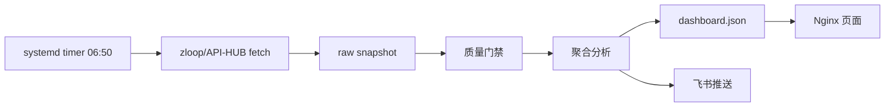

# AI 数据分析工作流迁移交接文档（服务器 + 数据快照 + zloop 流程）

> 日期：2026-07-14  
> 当前阶段：新服务器基础部署完成，旧服务器继续生产运行，新服务器展示旧服务器 W29 数据快照；下一步迁移 zloop/API-HUB 数据流程。

---

## 1. 当前结论

本次迁移已经完成以下内容：

- 新 AI 孵化区服务器已可访问：`http://10.47.193.16/`
- Nginx + 本机 Node API 已部署并通过 smoke test。
- 旧服务器 W29 真实数据已经迁到新服务器。
- 新旧 dashboard 完整 JSON hash 一致。
- 新服务器定时刷新和飞书推送暂未启用，避免与旧服务器双跑。
- gitclaw 迁移分支已推送。

当前运行策略：

| 项目 | 状态 |
|-|-|
| 旧服务器 | 继续作为生产刷新和飞书推送源运行 |
| 新服务器 | 作为迁移验证/预览环境，展示 W29 快照 |
| 新服务器 timer | disabled / inactive |
| 新服务器飞书推送 | 未启用 |
| 下一阶段 | 迁移 zloop/API-HUB 数据流程 |

---

## 2. 服务器信息

### 旧服务器（当前生产）

| 项 | 值 |
|-|-|
| 本地 SSH alias | `zz-server` |
| 云厂商 | Alibaba Cloud ECS |
| OS | Ubuntu 22.04.5 LTS |
| 公网入口 | `http://47.84.94.234:8848/` |
| 内网 IP | `172.19.34.189` |
| 主目录 | `/root/model-tag-monitor` |
| imports | `/root/workspace/ZZ-AI-Business-Analysis-base-migration/data/imports` |
| 角色 | 继续生产运行几天，负责定时刷新和飞书推送 |

### 新服务器（AI 孵化区）

| 项 | 值 |
|-|-|
| 实例 ID | `ins-rvc4ev4z` |
| 内网 IP | `10.47.193.16` |
| 主机名 | `tjtx47-193-16.zhuanos.com` |
| OA 账号 | `lixiaoran03` |
| OS | OpenCloudOS 9.6 |
| 架构 | x86_64 |
| 数据盘 | `/opt` mounted on `/dev/vdb`, 49G |
| 页面入口 | `http://10.47.193.16/` |
| API | `127.0.0.1:8848` only |
| Nginx | `0.0.0.0:80` |
| 角色 | 迁移验证/预览；后续正式切换承载 |

---

## 3. Git 仓库状态

### 本地源码基准

```text
/Users/lilixiaoran/工作/转转/ai数据分析工作流
```

### remotes

```text
origin -> https://gitclaw.zhuanspirit.com/lixiaoran03/ai_wxjyfx.git
github -> https://github.com/LXR110-bit/ZZ-AI-Business-Analysis.git
```

### 当前迁移分支

```text
codex/server-migration-20260714
```

### 已推送到 gitclaw 的关键提交

| commit | 说明 |
|-|-|
| `737e4d0` | 新增 AI incubation migration toolkit |
| `b8bd2b8` | 新增本机 API systemd unit |
| `324ac4c` | 修复可安装 npm lockfile |
| `ad51d3e` | Nginx `/api/` 反代修复 |
| `156b21d` | 移除页面 `localhost:8848` 旧跳转 |

> 注意：gitclaw `main` 未覆盖。当前只推了迁移分支。

---

## 4. 新服务器部署目录

```text
/opt/soft/model-tag-monitor/app              # 代码，目前为 archive 部署；后续建议改 gitclaw clone
/opt/soft/model-tag-monitor/conf             # env 配置
/opt/soft/model-tag-monitor/releases         # 迁移包/发布包

/opt/data/model-tag-monitor/current          # 当前 dashboard/API 数据
/opt/data/model-tag-monitor/raw/imports      # 迁移来的 imports CSV
/opt/data/model-tag-monitor/releases         # 后续发布数据版本
/opt/data/model-tag-monitor/snapshots        # 迁移快照和回滚点

/opt/log/model-tag-monitor/nginx
/opt/log/model-tag-monitor/worker
/opt/log/model-tag-monitor/release
/opt/log/model-tag-monitor/migration
```

### 服务

| 服务 | 当前状态 | 说明 |
|-|-|-|
| `model-tag-monitor-api.service` | enabled / active | 本机 Node API，监听 `127.0.0.1:8848` |
| `nginx.service` | enabled / active | 对办公网暴露 80 |
| `model-tag-monitor-refresh.timer` | disabled / inactive | 暂不启用，避免和旧机双跑 |
| `model-tag-monitor-refresh.service` | inactive | 暂不执行正式刷新 |

检查命令：

```bash
systemctl status model-tag-monitor-api.service --no-pager
systemctl status nginx --no-pager
systemctl status model-tag-monitor-refresh.timer --no-pager
```

---

## 5. 已解决的问题

### 5.1 Nginx 默认站点冲突

问题：OpenCloudOS 自带 Nginx 默认 server 与 `model-tag-monitor.conf` 均使用 `server_name _`，导致默认站点冲突。

处理：

- 备份：`/etc/nginx/nginx.conf.bak-20260714`
- 禁用原默认 80 server block
- 由 `/etc/nginx/conf.d/model-tag-monitor.conf` 接管 80

验证：

```bash
nginx -t
curl http://127.0.0.1/health
```

### 5.2 `/api/access/verify` 405

问题：页面门禁 POST `/api/access/verify` 被 Nginx 静态层处理，返回 405。

处理：新增 `/api/` 反代：

```nginx
location /api/ {
    proxy_pass http://127.0.0.1:8848;
    proxy_http_version 1.1;
    proxy_set_header Host $host;
    proxy_set_header X-Real-IP $remote_addr;
    proxy_set_header X-Forwarded-For $proxy_add_x_forwarded_for;
    proxy_set_header X-Forwarded-Proto $scheme;
    proxy_read_timeout 900s;
    proxy_send_timeout 900s;
}
```

验证：

```bash
curl http://10.47.193.16/api/health
```

### 5.3 npm lockfile 不可安装

问题：`package-lock.json` 锁到了不存在的 `on-headers@1.2.0`。

处理：重新生成可安装 lockfile，`on-headers` 回到 `1.1.0`。

验证：

```bash
cd model-tag-monitor
npm ci --omit=dev --dry-run
npm test
```

### 5.4 旧 IP / localhost 残留

问题：页面曾有 `file://` 兜底跳转到 `localhost:8848`。

处理：改为相对路径：

```js
location.replace('/' + location.search + location.hash);
```

当前新服务器静态页面和 dashboard JSON 未发现旧公网 IP `47.84.94.234` 残留。

---

## 6. 数据迁移状态

### 迁移内容

从旧服务器迁移：

```text
/root/model-tag-monitor/data
/root/workspace/ZZ-AI-Business-Analysis-base-migration/data/imports
```

到新服务器：

```text
/opt/data/model-tag-monitor/current
/opt/data/model-tag-monitor/raw/imports
```

### 数据规模

| 项 | 数量/大小 |
|-|-|
| data 文件 | 12 个 |
| imports 文件 | 27 个 |
| data 大小 | 179M |
| imports 大小 | 1.3G |
| 迁移归档 | 292M |

### 快照位置

```text
/opt/data/model-tag-monitor/snapshots/20260714-old-server
```

归档 SHA256：

```text
0e82d8b3c107524d7f345afb5bb8d7cc4085fb03ee04c673059d60905082373c
```

### 对账结果

完整 dashboard 对账：

| 项 | 结果 |
|-|-|
| 旧服务器 API dashboard hash | `561453e441a98c84da328ae30ed686642b932d1a1554f037d02f9ac00c5f838e` |
| 新服务器 API dashboard hash | 同上 |
| 新服务器 `/data/dashboard.json` hash | 同上 |
| 是否完全一致 | 是 |

数据摘要：

```json
{
  "version": "1.5.2",
  "week": "2026-W29",
  "prevWeek": "2026-W28",
  "kpiCards": 7,
  "tiers": 3,
  "categories": 112,
  "hasInsights": true
}
```

---

## 7. 当前运行策略：旧机继续生产，新机只预览

用户明确要求：旧服务器内容还需要继续跑几天。

因此当前策略：

1. 旧服务器继续生产运行。
2. 新服务器只展示迁移快照。
3. 新服务器不启用定时刷新。
4. 新服务器不发正式飞书消息。
5. 如需新机展示最新数据，手动再同步一次旧机快照。

不要执行：

```bash
systemctl enable --now model-tag-monitor-refresh.timer
```

除非正式切换。

---

## 8. 手动同步旧机最新数据的步骤

当旧机继续运行期间，如果需要让新机同步到最新数据，执行以下流程。

### 8.1 旧机生成归档

在本地通过 `zz-server` 执行：

```bash
ssh zz-server '
set -euo pipefail
stamp=$(date +%Y%m%dT%H%M%S%z)
base=/tmp/model-tag-monitor-data-migration-$stamp
manifest=$base.manifest.sha256
archive=$base.tar.gz
sudo bash -c "cd /root/model-tag-monitor && find data -maxdepth 1 -type f -print0 | sort -z | xargs -0 sha256sum > $manifest"
sudo bash -c "cd /root/workspace/ZZ-AI-Business-Analysis-base-migration/data && find imports -maxdepth 1 -type f -print0 | sort -z | xargs -0 sha256sum >> $manifest"
sudo tar -czf "$archive" -C /root/model-tag-monitor data -C /root/workspace/ZZ-AI-Business-Analysis-base-migration/data imports
sudo sha256sum "$archive" | tee "$base.archive.sha256"
echo "$archive"
'
```

### 8.2 临时下载方式

上次验证过：旧机 SSH 下载很慢，使用旧机 `8848` 随机临时 symlink 速度更好。

原则：

- 生成随机路径
- 新机下载完成后立即删除 symlink
- URL 不长期保留

### 8.3 新机解压和发布

在新机：

```bash
cd /opt/data/model-tag-monitor/snapshots/<snapshot>
sha256sum -c archive.sha256
mkdir staging
tar -xzf data-migration.tar.gz -C staging
cd staging
sha256sum -c ../manifest.sha256

rsync -a --delete staging/data/ /opt/data/model-tag-monitor/current/
rsync -a --delete staging/imports/ /opt/data/model-tag-monitor/raw/imports/

systemctl restart model-tag-monitor-api.service
set -a; . /opt/soft/model-tag-monitor/conf/model-tag-monitor.env; set +a
node /opt/soft/model-tag-monitor/app/model-tag-monitor/scripts/publish-dashboard-json.js \
  --api-base http://127.0.0.1:8848 \
  --out-dir /opt/data/model-tag-monitor/current
```

---

## 9. zloop 流程迁移目标

下一阶段目标：把当前“旧机/本地 imports 快照”逐步替换为 zloop/API-HUB 数据源。

### 当前旧链路


### 目标 zloop 链路



### 推荐迁移策略

分两步走。

#### Phase 1：兼容 CSV 输出

zloop 拉数后，先生成当前代码已经能消费的 CSV 文件：

```text
/opt/data/model-tag-monitor/raw/imports/model_daily_avg_YYYY-MM.csv
/opt/data/model-tag-monitor/raw/imports/model_summary_YYYY-MM.csv
/opt/data/model-tag-monitor/raw/imports/category_daily_avg_YYYY-MM.csv
/opt/data/model-tag-monitor/raw/imports/category_summary_YYYY-MM.csv
/opt/data/model-tag-monitor/raw/imports/category_fulfill_daily_avg_YYYY-MM.csv
/opt/data/model-tag-monitor/raw/imports/category_fulfill_summary_YYYY-MM.csv
/opt/data/model-tag-monitor/raw/imports/board_metrics_feishu.csv
```

优点：

- 对现有 `sync.js` / `category-sync.js` / `board-sync.js` 改动最小。
- 可以直接复用现有质量门禁。
- 最容易和旧服务器 imports 对账。

#### Phase 2：原生 JSON/接口输出

等 Phase 1 稳定后，再考虑让 zloop 直接输出标准化 JSON，减少 CSV 中转。

---

## 10. zloop 迁移时必须保留的质量门禁

迁移 zloop 时，不能只看“接口跑通”，必须保留这些门禁：

1. 周次范围正确：当前至少覆盖 W28/W29 对比。
2. `board_metrics_feishu.csv` 中 APP DAU / 回收入口 UV 不为空。
3. 分类数据包含 112 个在管品类口径。
4. 核心 KPI 与旧链路同周次一致或差异可解释。
5. AI 洞察不能泄漏技术字段名。
6. 生成失败时不能覆盖上一版有效 `dashboard.json`。
7. 飞书推送必须 dry-run 通过后再正式发送。

---

## 11. zloop 迁移建议任务拆分

### Task A：列出当前 imports contract

输出每类 CSV 的字段定义、必填字段、类型、周次字段、月文件命名规则。

涉及代码：

```text
model-tag-monitor/src/csv-reader.js
model-tag-monitor/src/sync.js
model-tag-monitor/src/category-sync.js
model-tag-monitor/src/board-sync.js
model-tag-monitor/scripts/validate-daily-import-coverage.js
```

### Task B：zloop fetcher MVP

新增一个脚本，例如：

```text
model-tag-monitor/scripts/fetch-zloop-imports.js
```

职责：

- 调用 zloop/API-HUB
- 输出到 staging import dir
- 生成 manifest
- 不直接覆盖生产 imports

建议输出：

```text
/opt/log/model-tag-monitor/worker/local-imports-<run_id>/
```

### Task C：复用 promote-local-imports

zloop 拉出的 staging imports 通过现有：

```text
model-tag-monitor/scripts/promote-local-imports.js
```

合入：

```text
/opt/data/model-tag-monitor/raw/imports
```

### Task D：dry-run 刷新

```bash
FEISHU_DRY_RUN=1 \
IMPORT_DIR=/opt/data/model-tag-monitor/raw/imports \
/opt/soft/model-tag-monitor/app/model-tag-monitor/scripts/refresh-dashboard-daily.sh
```

### Task E：新旧对账

对比旧机和新机：

- dashboard hash
- KPI summary
- categories 数量
- Top categories
- insights hash

---

## 12. 正式切换步骤

等旧服务器可以停时：

1. 通知迁移窗口。
2. 停旧机 cron。
3. 旧机生成最后一次数据包。
4. 同步到新机。
5. 新机生成 dashboard。
6. 对账通过。
7. 配置新机真实 secrets。
8. `FEISHU_DRY_RUN=0`。
9. 启用：

```bash
systemctl enable --now model-tag-monitor-refresh.timer
```

10. 旧机保留 7 天只读回滚。

---

## 13. 当前不能忘的安全事项

- 不要把 git token、OpenAI key、飞书 secret、zloop 凭据写进 Git 或聊天。
- 之前暴露过的 gitclaw token 应视为泄露，建议 revoke。
- 当前页面门禁码已按用户要求设置，但后续正式开放前建议更换。
- 新机当前 `FEISHU_DRY_RUN=1`，不要误改为正式发送，除非确认切换。

---

## 14. 快速状态检查命令

### 新机页面/API

```bash
curl http://10.47.193.16/health
curl http://10.47.193.16/data/dashboard.json
```

### 新机服务

```bash
systemctl is-active model-tag-monitor-api.service nginx
systemctl is-enabled model-tag-monitor-api.service nginx
systemctl is-active model-tag-monitor-refresh.timer
systemctl is-enabled model-tag-monitor-refresh.timer
```

### dashboard 摘要

```bash
node - <<'NODE'
const fs=require('fs');
const d=JSON.parse(fs.readFileSync('/opt/data/model-tag-monitor/current/dashboard.json','utf8'));
console.log({version:d.version, week:d.week, prevWeek:d.prevWeek, kpiCards:d.kpiCards?.length, tiers:d.tiers?.length, categories:d.categories?.length, hasInsights:!!d.insights});
NODE
```

---

## 15. 当前交接重点

给下一个执行 zloop 迁移的人：

1. 不要急着启用新机 timer。
2. 先把 zloop 输出做成当前 imports CSV contract。
3. 用新机 dry-run 跑完整刷新。
4. 和旧机 dashboard 做 hash/核心指标对账。
5. 只有旧机准备停更时，才做最终切换。
